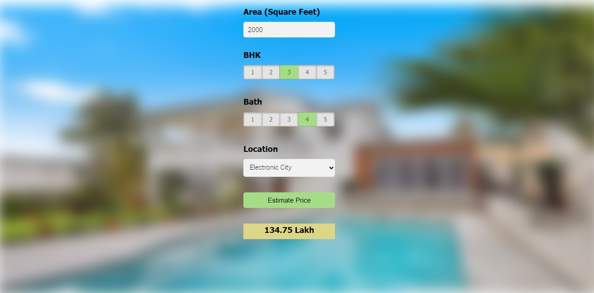

# Home Price Prediction for Bangalore

This project aims to predict home prices in Bangalore using key factors such as square footage, number of BHKs, number of bathrooms, and the location of the property. The prediction is done through a machine learning model deployed on a Flask backend, and the user interacts with a simple web interface to input the required data and view the predicted price.



## Table of Contents

- [Project Overview](#project-overview)
- [Technologies Used](#technologies-used)
- [Project Structure](#project-structure)

## Project Overview

This web application allows users to estimate the price of a house in Bangalore based on various parameters such as:
- Total area in square feet.
- Number of bedrooms (BHK).
- Number of bathrooms.
- Location within Bangalore.

The project utilizes a machine learning model trained on historical real estate data to provide predictions.

## Technologies Used

- **Frontend**: HTML, CSS, JavaScript, jQuery
- **Backend**: Flask (Python)
- **Machine Learning**: Scikit-learn
- **Libraries/Frameworks**:
  - jQuery for AJAX requests
  - Scikit-learn for machine learning model
  - Flask for serving the application
- **Deployment**: Flask local server or Nginx (optional)

## Project Structure

```bash
.
├── app.py                # Flask app for backend
├── model.py              # Python script for ML model training
├── templates/
│   └── index.html        # Frontend HTML file
├── static/
│   ├── app.js            # JavaScript for handling form and AJAX requests
│   ├── app.css           # Styling for the application
│   └── Home_prediction_website.jpeg    # Screenshot of the UI (for README)
├── README.md             # This README file
├── requirements.txt      # Python dependencies
└── model.pkl             # Trained model file (generated after training)
